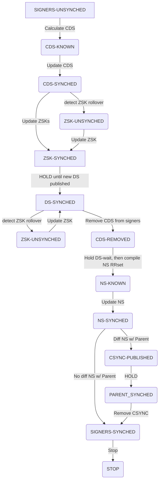
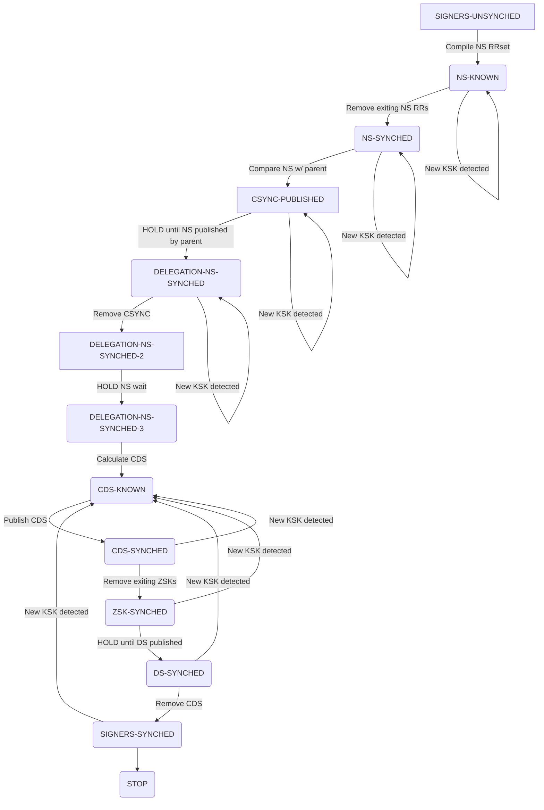

The ADD-SIGNER process:

```mermaid
graph TD;
    A[SIGNERS-UNSYNCHED] -->|Calculate CDS| B(CDS-KNOWN);
    B --> |Update CDS| C(CDS-SYNCHED);
    C -->|Update ZSKs| D[ZSK-SYNCHED];
    C -->|detect ZSK rollover| C1(ZSK-UNSYNCHED);
    C1 -->|Update ZSK| D;
    D -->|HOLD until new DS published| E[DS-SYNCHED];
    E -->|detect ZSK rollover| E1(ZSK-UNSYNCHED);
    E1 -->|Update ZSK| E;
    E -->|Remove CDS from signers| F(CDS-REMOVED);
    F -->|Hold DS-wait, then compile NS RRset| G(NS-KNOWN);
    G -->|Update NS| H(NS-SYNCHED);
    H -->|Diff NS w/ Parent| I(CSYNC-PUBLISHED);
    H -->|No diff NS w/ Parent| K;
    I -->|HOLD| J(PARENT_SYNCHED);
    J -->|Remove CSYNC| K(SIGNERS-SYNCHED);
    K -->|Stop| L(STOP);
```

The REMOVE-SIGNER process with KSK rollover detection:

```mermaid
graph TD;
    A[SIGNERS-UNSYNCHED] -->|Compile NS RRset| B(NS-KNOWN);
    B --> |Remove exiting NS RRs| C(NS-SYNCHED);
    B --> |New KSK detected| B;
    C --> |Compare NS w/ parent| D[CSYNC-PUBLISHED];
    C --> |New KSK detected| C;
    D --> |HOLD until NS published by parent| E(DELEGATION-NS-SYNCHED);
    D --> |New KSK detected| D;
    E --> |Remove CSYNC| F[DELEGATION-NS-SYNCHED-2];
    E --> |New KSK detected| E;
    F --> |HOLD NS wait| G(DELEGATION-NS-SYNCHED-3);
    G --> |Calculate CDS| H(CDS-KNOWN);
    H --> |Publish CDS| I(CDS-SYNCHED);
    I --> |Remove exiting ZSKs| J(ZSK-SYNCHED);
    J --> |HOLD until DS published| K(DS-SYNCHED);
    K --> |Remove CDS| L(SIGNERS-SYNCHED);
    L --> M(STOP);
    K --> |New KSK detected| H;
    I --> |New KSK detected| H;
    J --> |New KSK detected| H;
    L --> |New KSK detected| H;
```
